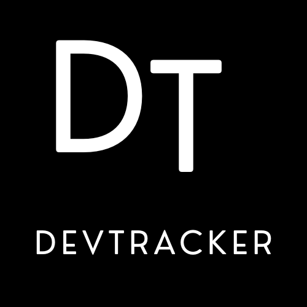

  

    

  
  
  
  

 

# DevTracker

## Tabela de Conteúdos

* [Sobre o DevTracker](#sobre-o-devtracker)
  * [Qual problema a aplicação resolve](#qual-problema-a-aplicação-resolve)
* [Features](#features-principais)
* [Guia de Setup Local](#guia-de-setup-local)
* [Status do Projeto](#status-do-projeto)
* [Como Contribuir](#como-contribuir-para-o-projeto)
* [Authors](#authors)

---

## Sobre o DevTracker

O **DevTracker** é uma plataforma open-source de agregação de vagas em tecnologia, projetada para resolver o problema da fragmentação na busca por oportunidades de emprego, especialmente para desenvolvedores juniores.

### Qual problema a aplicação resolve

DevTracker é focado em reduzir drasticamente o tempo de procura por vagas em diferentes sites, ou seja, todas as vagas relevantes e as quais encaixam perfeitamente no seu perfil irão aparecer de forma unificada para você em apenas uma tela. Assim, resolvendo os seguintes problemas:

- Cansaço e perda de tempo ao navegar por diversos sites.
- Dificuldade para encontrar vagas que encaixam em seu perfil.

---

## Features principais

A aplicação é focada em produtividade e eficiência, permitindo:

- **Busca diversificada:** Com base em suas preferências, fazemos buscas em diversos sites de empregos e retornamos as vagas que mais se encaixam no seu perfil.
- **Filtros precisos:** Busca refinada por cargo, localização e senioridade.
- **Redirecionamento otimizado:** Links diretos para a página de candidatura oficial.
- **Não é necessário ser cadastrado:** Uso completo da plataforma sem necessidade de criar uma conta.
- **Consistência visual:** Dados padronizados para facilitar a leitura e análise.

---

## Status do Projeto

🚧 **Em Desenvolvimento** 🚧

O DevTracker está atualmente na fase de construção da arquitetura base. Estamos estruturando o *core* do back-end em Java/Spring Boot para garantir uma lógica de busca e agregação de dados escalável, enquanto preparamos o terreno para o consumo desses dados pelo front-end em Angular.

---

## Como Contribuir para o projeto? 

O DevTracker é um projeto feito para ajudar a comunidade, e toda contribuição é muito bem-vinda! Como nosso ecossistema é um *monorepo* abordando tanto o back-end (Java/Spring) quanto o front-end (Angular), sinta-se livre para atuar na área que você tem mais afinidade.

Para contribuir, siga o fluxo abaixo:

1. Faça um **Fork** deste repositório.
2. Crie uma branch para a sua implementação (seja uma feature ou correção de bug):
   `git checkout -b feature/minha-nova-feature`
3. Faça as alterações necessárias e teste no seu ambiente local.
4. Faça o **Commit** das suas alterações (encorajamos o padrão de [Conventional Commits](https://www.conventionalcommits.org/)):
   `git commit -m "feat: adiciona filtro por regime de contratação remoto"`
5. Faça o **Push** para a sua branch no seu fork:
   `git push origin feature/minha-nova-feature`
6. Abra um **Pull Request** neste repositório. Descreva de forma clara o que foi alterado, o motivo da mudança e anexe capturas de tela caso tenha modificado a interface visual.

Se você encontrar algum comportamento inesperado ou tiver uma ideia de nova funcionalidade, abra uma **Issue** detalhada para discutirmos a implementação.

---

## Authors

  
  

---

## Contribuidores

Este projeto open-source cresce com a força da comunidade! Se você quer ajudar a unificar o mercado de vagas para devs, sua contribuição é essencial.

Agradecemos imensamente aos nossos contribuidores atuais que ajudaram a construir as bases do DevTracker:

  

  <b>Sua foto aqui?</b> Dê um Fork no projeto e envie seu primeiro Pull Request!

